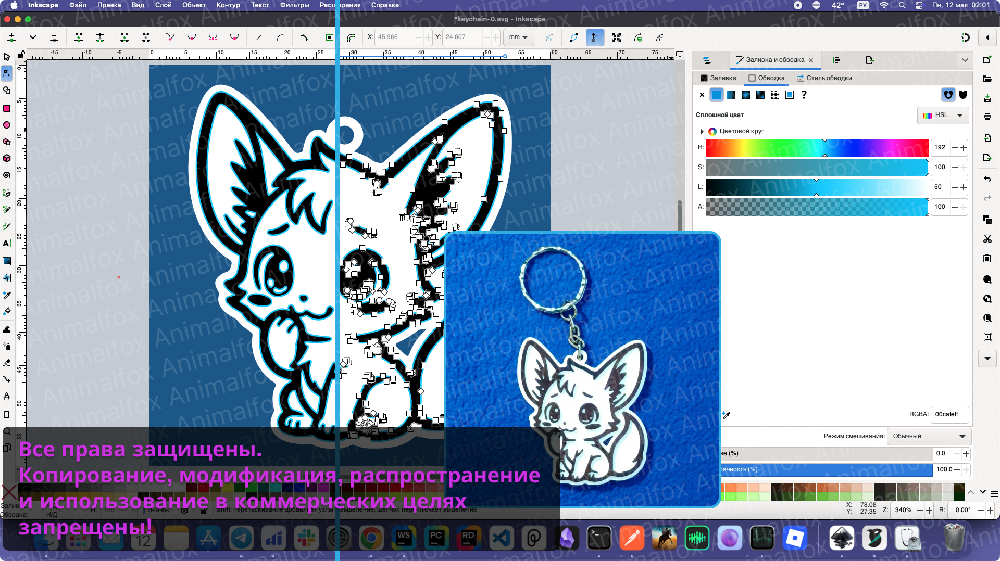

# Авторская 3D-модель брелока "Fox-Key-1"

**Автор**: Animalfox  
**Дата публикации**: 12 мая 2025  
**Контакты**: [t.me/animalfox](https://t.me/animalfox) | [95981a@gmail.com](mailto:95981a@gmail.com)

## 🛡 Описание

Это зашифрованный архив оригинальной 3D-модели, разработанной лично мной.  
Модель защищена авторским правом и не предназначена для свободного распространения.

Данный репозиторий создан **исключительно для фиксации авторства** с использованием временной метки коммита.

## 🧷 Содержимое

- `model.7z.aes` — зашифрованный архив STL-файла
- `hash.txt` — SHA256-хеш оригинального STL-файла
- `LICENSE.md` — авторская лицензия
- `preview.png` — эскизы и фотографии модели

## 🔒 Шифрование

Файл зашифрован с использованием алгоритма AES-256.  
Пароль хранится у автора и может быть предоставлен по запросу при необходимости доказательства авторства.

## ⚖️ Авторские права

Все права на дизайн и 3D-модель принадлежат автору.  
Любое копирование, перепродажа, модификация и коммерческое использование **запрещены** без письменного разрешения.
